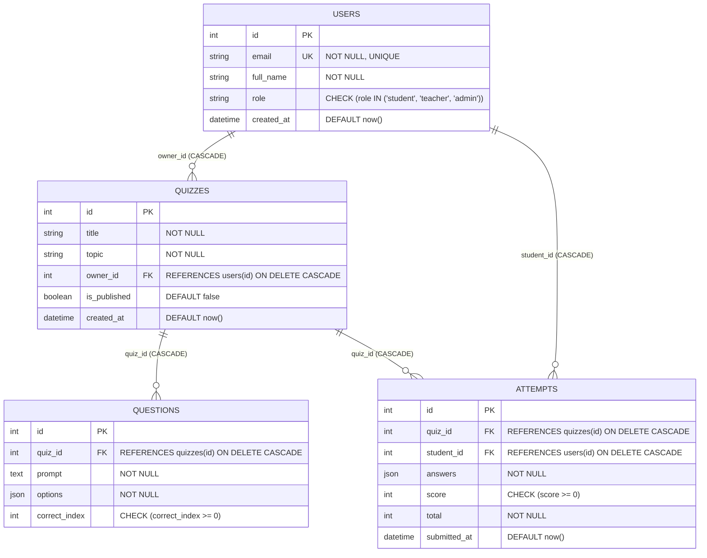

# ER диаграмма (6-сабақ)

```mermaid
erDiagram
    USERS ||--o{ QUIZZES : "owner_id (CASCADE)"
    USERS ||--o{ ATTEMPTS : "student_id (CASCADE)"
    QUIZZES ||--o{ QUESTIONS : "quiz_id (CASCADE)"
    QUIZZES ||--o{ ATTEMPTS : "quiz_id (CASCADE)"

    USERS {
        int id PK
        string email UK "NOT NULL, UNIQUE"
        string full_name "NOT NULL"
        string role "CHECK (role IN ('student', 'teacher', 'admin'))"
        datetime created_at "DEFAULT now()"
    }

    QUIZZES {
        int id PK
        string title "NOT NULL"
        string topic "NOT NULL"
        int owner_id FK "REFERENCES users(id) ON DELETE CASCADE"
        boolean is_published "DEFAULT false"
        datetime created_at "DEFAULT now()"
    }

    QUESTIONS {
        int id PK
        int quiz_id FK "REFERENCES quizzes(id) ON DELETE CASCADE"
        text prompt "NOT NULL"
        json options "NOT NULL"
        int correct_index "CHECK (correct_index >= 0)"
    }

    ATTEMPTS {
        int id PK
        int quiz_id FK "REFERENCES quizzes(id) ON DELETE CASCADE"
        int student_id FK "REFERENCES users(id) ON DELETE CASCADE"
        json answers "NOT NULL"
        int score "CHECK (score >= 0)"
        int total "NOT NULL"
        datetime submitted_at "DEFAULT now()"
    }
```
